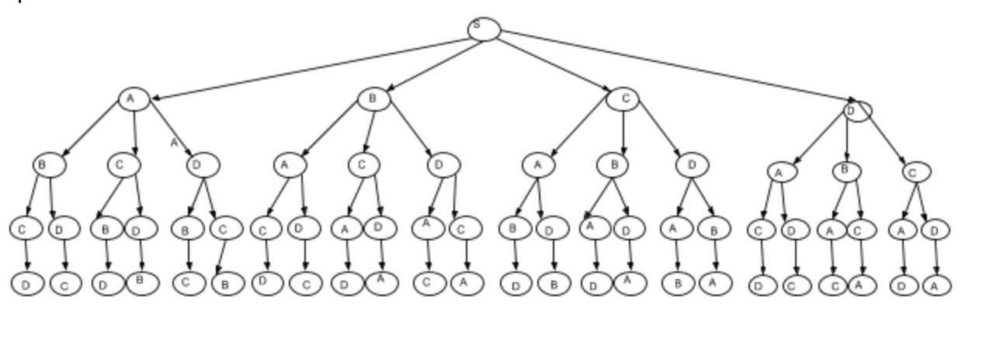
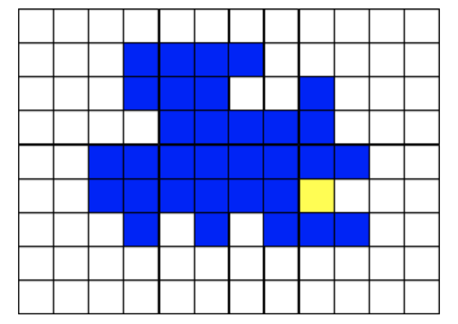
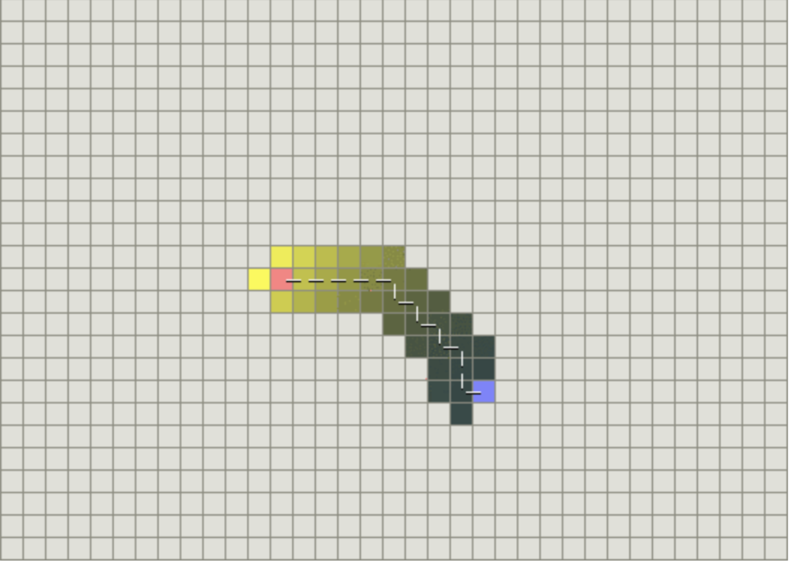
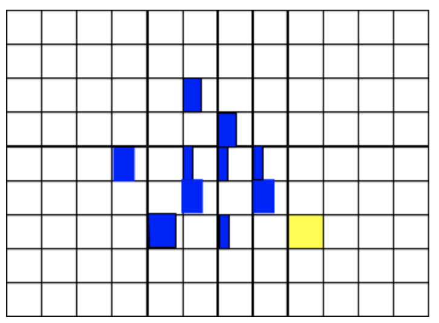
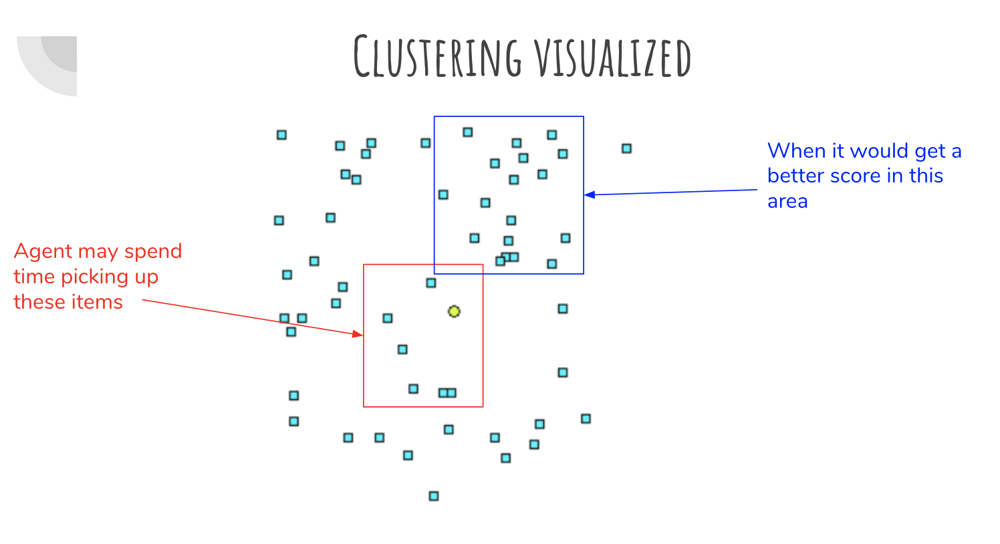
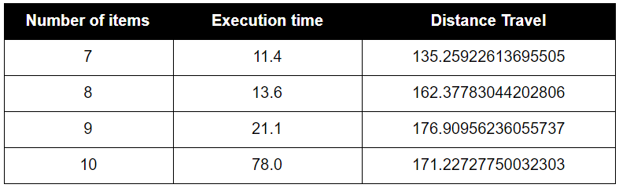
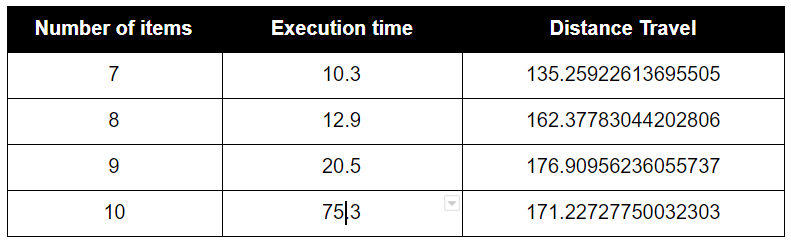
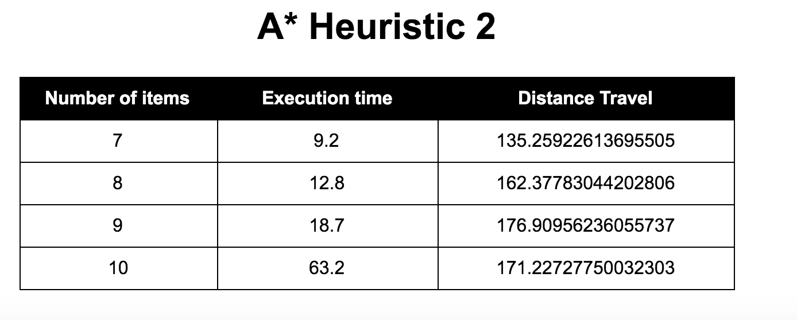

# Agent007: The A* Scholar Final Report

## Video:

## Project Summary:
Agent 007 is spawned on a fixed point on a flat 100x100 grid. This map generates item spawns with the locations known to the agent. The agent wants to pick up all the items on the grid with the most optimal path. The paths are judged based on distance travelled and the execution time. The goal of our project is to use different search strategies to solve this rendition of the traveling salesman problem. In other words, the agent wants to find the most optimal path, or the least distance travelled in the shortest amount of time possible. 

## Approaches:
- **Breadth First Search Algorithm:** 
Breadth first search will always find the most optimal solution, but it will do it rather slowly. Suppose there are 4 items on the map, each of these items will get expanded out with every single other item and generate every possible path. This will lead to 4x3x2x1 = 24 different combinations of item pickups.
 

 
Given agent position (x1, y1) and item position (x2, y2), we calculate the distance between the agent and the item using distance formula **D = sqrt((x2-x1)^2 + (y2-y1)^2)**. Then we store the total distance travelled of each combinations and return the path which has the lowest distance score as the optimal solution.
 

 
Each grid on this map represents a possible item sequence path. The agent will keep expanding until every single grid is explored. A teal grid in this case indicates the path was explored. The agent will not stop once that the optimal path has been found, since it has no way of knowing that is optimal until every unexplored path is checked. However, if we can reduce the number of full paths explorations we need to generate and still guarantee finding the optimal path, we can substantially speed up our search. 
 

- **Greedy Search Algorithm** 
The Greedy Search algorithm runs much faster than the BFS algorithm. It only finds the closest item given the current agent position until a path sequence is found. Again we use distance formula to compute the distance, but the agent position will be updated relative to the item position. Although it costs less time to finish the execution when there are many items on the map, the algorithm does not guaranteed to find the optimal path since it doesn't calculate the distance of all of the possible item pickup combinations.

 

- **A* Algorithm**  
The A* algorithm uses an admissible heuristic to optimistically find the optimal solution. As long as the cost the heuristic estimates to reach the goal is not higher than the lowest possible cost from the current point in the path, it admissible. In our project, the heuristics we choose cannot overpower the distance metric. 
 
 
 
Each grid on this map represents a possible sequence path. The agent will expand different paths based on the heuristic until all the items are picked up in one of the paths. If the yellow grid is the optimal path, it will be the first path to finish getting all items and that sequence shall return. If the heuristic is admissible, it will be the optimal path. 
 
In particular, we have two heuristic functions implemented:  
**Heuristic #1**:  
f(n) = c(n) + h(n), where 
c(n) = sum of the distance of all the items for a given path  
h(n) = minimum distance from the current position  
This heuristic builds seperate paths depending on the lowest cost path/item option to pick up a given time. When any path has been fully expanded out (every node has been visited) that path is returned as the optimal solution. This slows down computation from BFS as every single full path does not neccasarily need to be expanded.  
 
**Heuristic #2**:  
f(n) = c(n) + h(n), where  
c(n) = cluster heuristic + distance  
h(n) = cluster value from current item + minimum distance from current item  
Each item is scored by 1/distance to all other items. Agent position is considered an item.
 

 
Items close to many other items indicate a potential for less distance needed to travel if those items are expanded - we built the A* cluster heuristic around that ideal. The heuristic acts as **(the sum of all distances to other items from each item / number of items) x 0.05**. Since we don’t want to have the agent picking up high cluster items across the map, we make it play a small role and still heavily rely on distance. NOTE: this heuristic cannot prove admissibility, but provides optimal path in all 4 map variants.
 

## Evaluation:
We compute the execution time and the total distance travelled for each algorithm using 4 different map settings and compare the results.   
**Breadth First Search:**  
Breadth First Search Algorithm will always find the optimal path run with minimum distance travelled. However, the computation time is slow since it needs to calculate the distance of each possible item pickup combinations.
 

  
**Greedy Search:**
Greedy Search Algorithm does not find the optimal path but the computation time is relatively fast when the map have more items. It does not calculate the distance for every potential path; instead, it return the shortest path based on the current agent position.
 

  
**A* Search:**
A* Search Algorithm will always find the optimal path with a more efficient computation time.  
**A* Heuristic #1**  
The first heuristic calculate the lowest cost path at a given time rather than calculate all of the item pickup combinations at the start. Therefore, the computation time is slightly better than BFS.
 

 
**A* Heuristic #2**  
The second heuristic function 
 

 

  
Analysis:
As assumed, BFS scaled very poorly in execution time. Greedy Best First Algorithm never found the optimal solution, and the execution time was not much faster and at only led to better time preformance at higher item maps. The path found by the greedy search strategy was not much worse than the optimal solution, indicating greedy is a good algorithm to choose if the most optimal solution is not necessary and there are many items on the map. A* algotithms find the optimal path. A* heuristic #1 did the best out of all the search strategies except in the highest item map, where A* heuristic #2 found the optimal solution in less time than utilzing heuristic #1. This indicates the clustering heuristic inclusion is very helpful in high density item maps (especially considering an extra cluster calculation has to be made for every item on the map with this heuristic). 

 
## References:
https://arxiv.org/pdf/1210.4913.pdf
http://theory.stanford.edu/~amitp/GameProgramming/Heuristics.html
https://artint.info/2e/html/ArtInt2e.Ch3.S6.SS2.html
http://theory.stanford.edu/~amitp/GameProgramming/AStarComparison.html

Reports:

- [Proposal](proposal.html)
- [Status](status.html)
- [Final](final.html)

Source Code:

